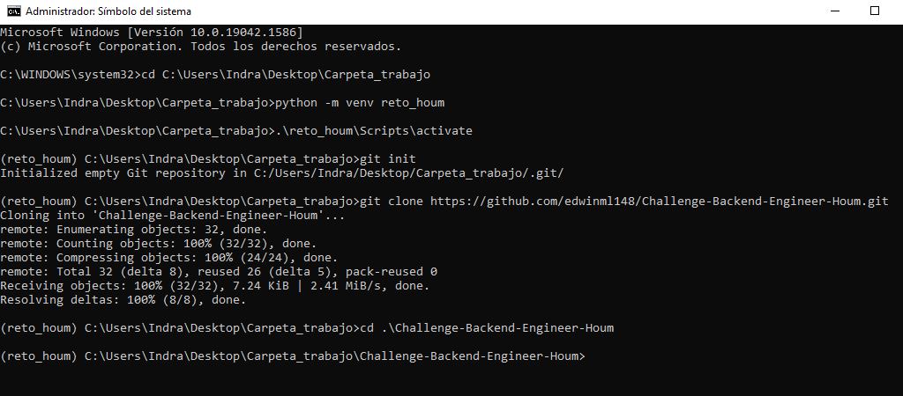
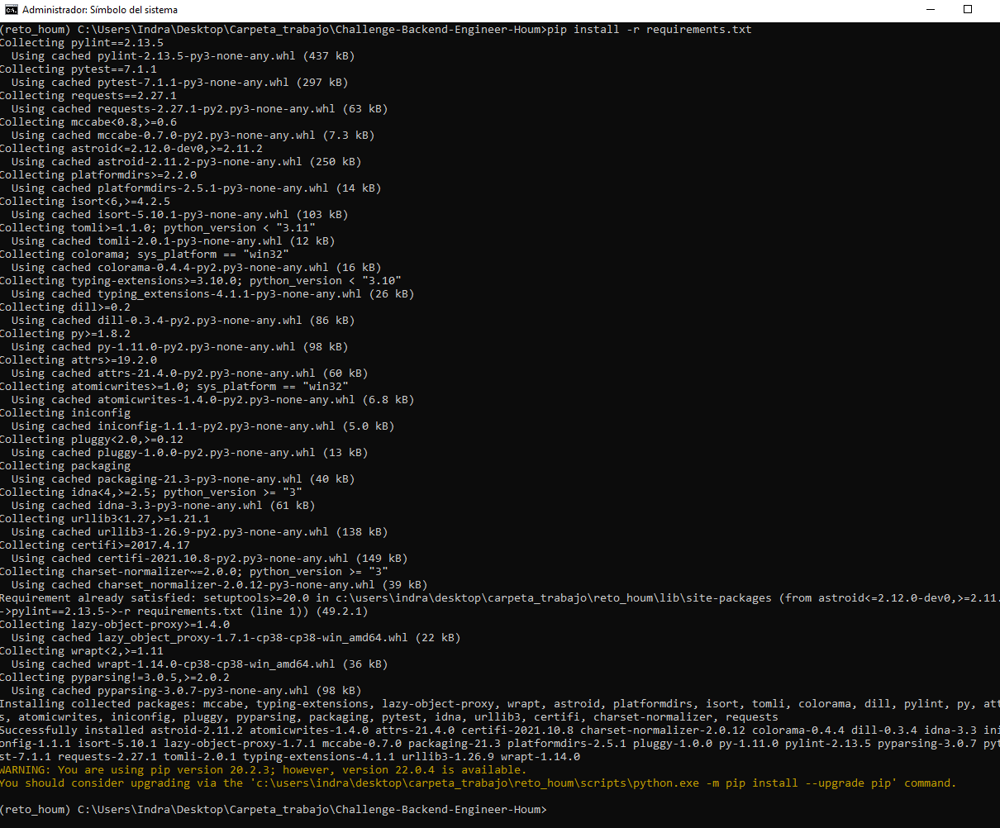
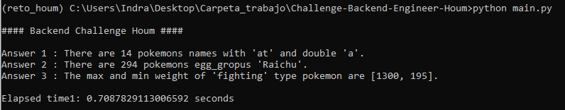
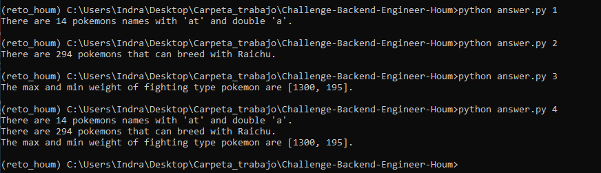
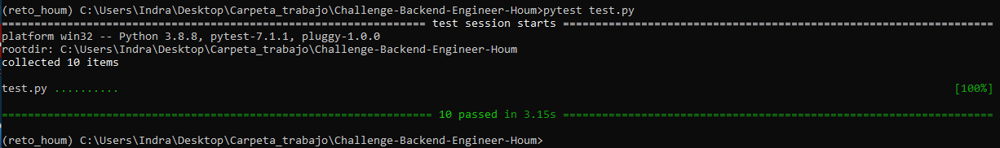

# Challenge-Backend-Engineer-Houm

## 1. instalacion:

Para el siguiente reto se utilizo ***Python 3.8.8***. Se requiere instalar la siguiente librerias.

* requests==2.27.1
* pylint==2.13.5
* pytest==7.1.1

Para ver los resultados instalaremos el proyecto en entorno local , debemos crear una carpeta de trabajo y abrir el CMD en esa ruta (Se recomienda abrir con permisos de administrador), luego usar los siguientes comandos en ese orden.

* ```python -m venv reto_houm```
* ```.\reto_houm\Scripts\activate```
* ```git init```
* ```git clone https://github.com/edwinml148/Challenge-Backend-Engineer-Houm.git```
* ```cd .\Challenge-Backend-Engineer-Houm```
* ```pip install -r requirements.txt```


<div style="text-align: center;">
  <br><br/>
  
  
  <br><br/>
</div>

## 2. Resultados:

Las preguntas del reto son :

1. Obtén cuantos pokemones poseen en sus nombres “at” y tienen 2 “a” en su nombre, incluyendo la primera del “at”. Tu respuesta debe ser un número.
2. ¿Con cuántas especies de pokémon puede procrear raichu? (2 Pokémon pueden procrear si están dentro del mismo egg group). Tu respuesta debe ser un número. Recuerda eliminar los duplicados.
3. Entrega el máximo y mínimo peso de los pokémon de tipo fighting de primera generación (cuyo id sea menor o igual a 151). Tu respuesta debe ser una lista con el siguiente formato: [1234, 12], en donde 1234 corresponde al máximo peso y 12 al mínimo.

Para poder observar el resultado sobre la ventana de CMD que ya tenemos abierta aplicar cualquiera de estos comandos

* ```python main.py```

<div style="text-align: center;">
  <br><br/>
  
  <br><br/>
</div>

* ```python answer.py 1```
* ```python answer.py 2```
* ```python answer.py 3```
* ```python answer.py 4```

<div style="text-align: center;">
  <br><br/>
  
  <br><br/>
</div>

## 3. Prueba Test:

Para los test se utilizo la libreria ***pytest***. Para correr los test , sobre la misma ventana de CMD que ya tenemos abierta aplicar el comando.

* ```pytest test.py```

<div style="text-align: center;">
  <br><br/>
  
  <br><br/>
</div>


## 4. Pylint:

Se uso un la libreria Pylint para el analisis estatico del codigo para identificar errores en el codigo en el python. Para poder ver el porcentaje de acierto debe aplicar el siguiente comando.

* ```pylint function.py```